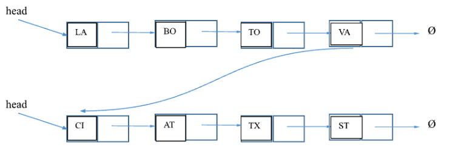
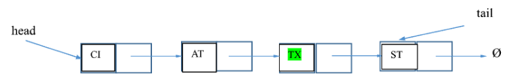

# Practice for Mid-Term Test

**Using Fundamental Data Structures (Arrays, Linked Lists), Stacks, and
Queues**

References: Chapter 3,4,5,6 lecture slides, lab assignments. This
material provides the necessary information that you need to complete
the exercises.

## Exercise 1

Write a method for **concatenating two singly linked lists L1 and L2**,
into a single list **L3** that contains all the nodes of **L1** followed
by all the nodes of **L2**.

**Hint**: Traverse list L1 until you reach the last element. Then, make
the last element of L1 point to the first element of L2 as its “next”
node.

Let’s use the SinglyLinkedList implementation from Lesson 2 slides. Do
not use the tail.



We need to traverse the list L1 to reach the last node. Then, we need to
link the last node of L1 to first node of L2. This is easy, knowing that
*head* of L2 already is the required link. The code below creates the
concatenate method inside SinglyLinkedList class:

```java
//concatenate two singly linked lists
//input: L1, L2 are singly linked lists
//output: the concatenated version
public <E> SinglyLinkedList<E> concatenateLists(SinglyLinkedList<E> L1,
		SinglyLinkedList<E> L2) {
	// Create a new node v
	Node<E> walk = new Node<E>(null, null);
	walk = L1.head; // point to head of L1
	// traverse L1
	while (walk.getNext() != null)
		walk = walk.getNext();
	// link to header of list L2
	walk.setNext(L2.head);
	// return the concatenated list
	return L1;
}

//
public static void main(String[] args) {
	SinglyLinkedList<String> list1 = new SinglyLinkedList<String>();
	list1.addFirst("MSP");
	list1.addLast("ATL");
	list1.addLast("BOS");
	SinglyLinkedList<String> list2 = new SinglyLinkedList<String>();
	//
	list2.addFirst("YYZ");
	list2.addLast("MTRL");
	list2.addLast("OTW");
	System.out.println(list1);
	System.out.println(list2);
	//
	System.out.println(list1.concatenateLists(list1, list2));
	System.out.println(list1.secondToLast().getElement());
}
```

## Exercise 2

Write a method for finding **the second-to-last node** in a singly
linked list in which the last node is indicated by a null next
reference.



Again, we need to traverse the list. However, this time we stop at the
node before the last node. Note the use of getNext() method two times in
the loop condition, to ensure that we reach the second-to-last node. Add
this method to SinglyLinkedList class.

```java
//find the second-to-last node in a list
public Node<E> secondToLast() {
	// make sure the list has at least two nodes
	if (size < 2)
		throw new IllegalStateException("list must have 2 or more entries");
	// navigate
	Node<E> walk = head;
	while (walk.getNext().getNext() != null) {
		walk = walk.getNext();
	}
	return walk;
}
// main method

// main method
public static void main(String[] args) {
	SinglyLinkedList<String> list1 = new SinglyLinkedList<String>();
	list1.addFirst("MSP");
	list1.addLast("ATL");
	list1.addLast("BOS");
	SinglyLinkedList<String> list2 = new SinglyLinkedList<String>();
	//
	list2.addFirst("YYZ");
	list2.addLast("MTRL");
	list2.addLast("OTW");
	System.out.println(list1);
	System.out.println(list2);
	//
	System.out.println(list1.secondToLast().getElement());
}
```

## Exercise 3

Write a short recursive Java method that takes a character string **s**
and **outputs its reverse**. For example, the reverse of 'pots&pans'
would be 'snap&stop'

Let ***n*** be the index of last character in a string ***s***. For
example, if s="ab", then n=1. String method *charAt (int index),*
returns the character given its index in a string.

The statement **s.charAt(n)** will return character ’b’. The statement
**s.charAt(n-1)** will return “a”. You can see how this can become a
recursive call. The **stopping point is n = 0**. See the code below:

```java
public class ReverseString {

	public static void main(String[] args) {
		// TODO Auto-generated method stub
		String s = "COMP";
		reverse(s);
	}

	public static void reverse(String s) {
		reverse(s, s.length() - 1); // reverse it

	}

	// input: a string and the index of the last character in it
	// output: reversed string
	public static void reverse(String s, int n) {
		// stopping condition
		// if( n<0 ) throw new IllegalStateException("String must have one or more
		// chars");
		if (n >= 0) {
			System.out.println(s.charAt(n));
			//
			reverse(s, n - 1);// recur
		}
	}
}
```

## Exercise 4

Let A be an array of size **n** containing integers from **1 to n-1
inclusive**, one of which is repeated. Design an algorithm for **finding
the integer in A that is repeated**.

```java
public class RepeatedInt {

	public static void main(String[] args) {
		// // integers from 1 to n-1 inclusive, one of which is repeated
		int a[] = { 1, 2, 3, 3, 4, 5 };
		System.out.println(findRepeatedInt(a));

	}

	/*
	 * Let A be an array of size n containing integers
	 * from 1 to n-1 inclusive, one of which is repeated.
	 * Describe an algorithm for finding the integer in A that is
	 * repeated.
	 */
	public static int findRepeatedInt(int[] A) {
		boolean[] found = new boolean[A.length]; // all elements false, by default
		for (int val : A)
			if (found[val])
				return val;
			else
				found[val] = true;

		return -1; // shouldn't happen if input as expected
	}
}
```
